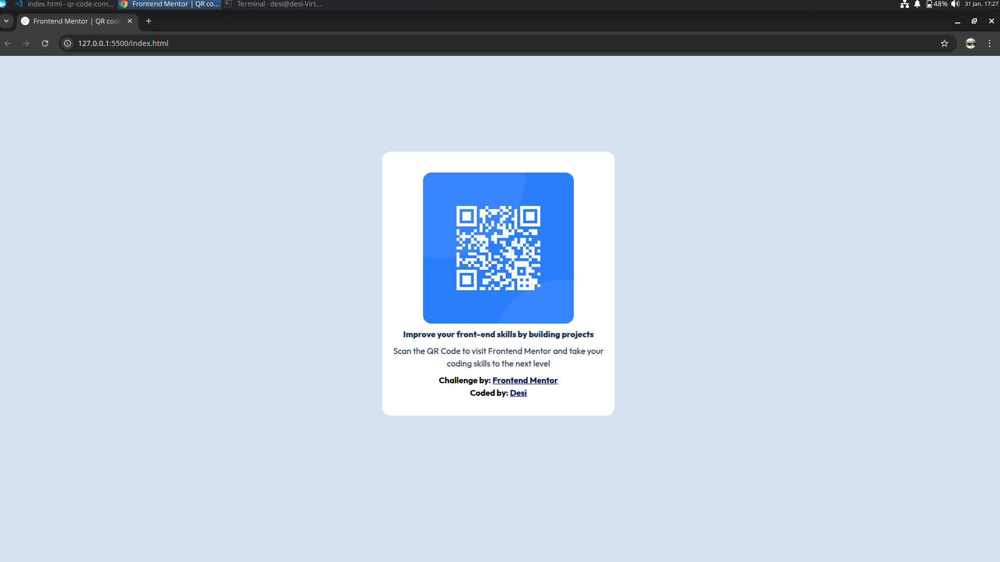

# Frontend Mentor - QR code component solution

This is a solution to the [QR code component challenge on Frontend Mentor](https://www.frontendmentor.io/challenges/qr-code-component-iux_sIO_H).
Frontend Mentor challenges help you improve your coding skills by building realistic projects.

## Table of contents

- [Overview](#overview)
  - [Screenshot](#screenshot)
  - [Links](#links)
- [My process](#my-process)
  - [Built with](#built-with)
  - [What I learned](#what-i-learned)
  - [Continued development](#continued-development)
- [Author](#author)
- [Acknowledgments](#acknowledgments)

## Overview

Used pure HTML and CSS to build a QR code component based on the design provided in the challenge.
The CSS technique used is Flexbox to center and align the elements on the page without any particular responsive design-related CSS.
Used Google Gemini for GPT assistance for centering the `main` container to the center of the screen

### Screenshot



## Links

- Solution URL: [Add solution URL here](https://your-solution-url.com)
- Live Site URL: [Add live site URL here](https://your-live-site-url.com)

[**Github repository**](#)

## My process

### Built with

- Semantic HTML5 markup
- CSS custom properties
- Flexbox
- Google Gemini

### What I learned

I figured out that I just needed to add `vh90` as the value of the `height`declaration in the `body` selector to achieve element centering on the page.

_(Thanks to Google Gemini SRE AI tool response)_

Relevant code & selector:

```css
body {
  background-color: var(--color-slate-300);
  width: fit-content;
  max-width: 1444px;
  min-width: 375px;
  height: auto;
  margin: 0 auto;
  display: flex;
  flex-flow: column;
  justify-content: center;
  align-items: center;
  height: 90vh; 
    /* ensures parent container's children are centered on all screens and devices
  by taking 90% of the viewport (100% suggested by Gemini via Google SRE, but was developed on a 15" HP laptop using a Xubuntu Virtual Machine, so that worked for me) */
  }
```

### Continued development

I will revisit the CSS and Flexbox lessons from [The Odin Project](https://www.theodinproject.com/paths/foundations/courses/foundations#css-foundations) and think thoroughly first when using it again in similar projects.

## Author

- Frontend Mentor - [@desilvavelasquez123](https://www.frontendmentor.io/profile/desilvavelasquez123)

## Acknowledgments

Big thanks to ... for encouraging me to submit this challenge and suggest to review it. I truly appreciate the support!

## Author

- Website (GH Pages) - [DeSi's QR Code Component](#)